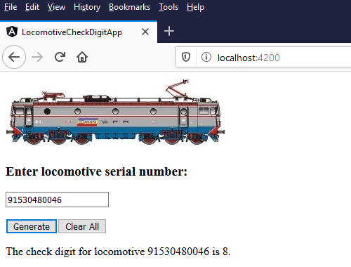
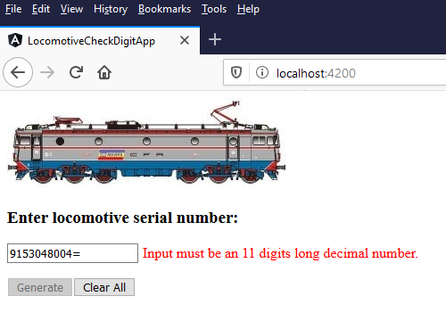
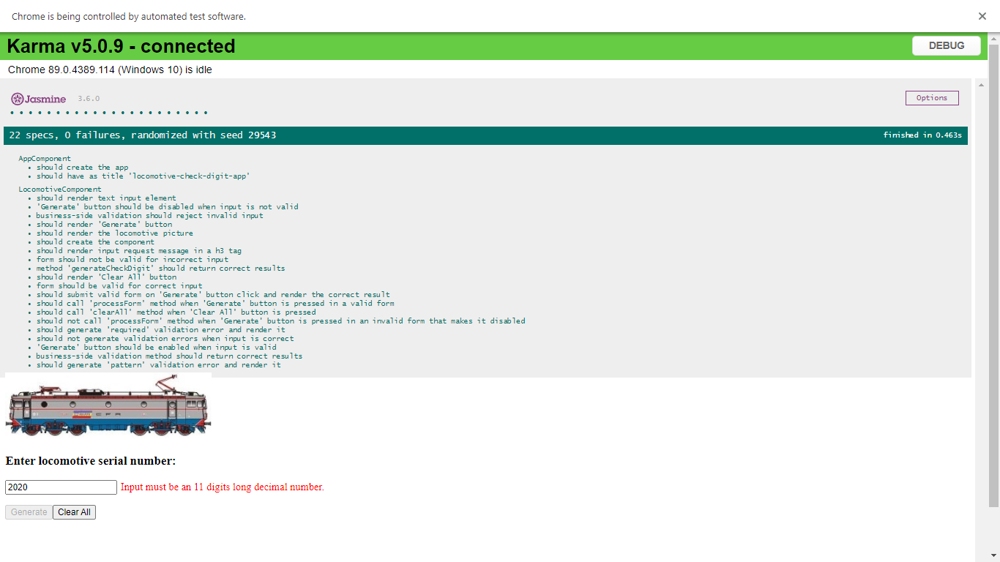

<h1>Locomotive Check Digit Generator Using Angular</h1>
<a href="#section1">Introduction</a><br>
<a href="#section2">Usage examples</a><br>
<a href="#section3">Formula for calculating the check digit</a><br>
<a href="#section4">How to run the application</a><br>
<a href="#section5">The reason for creating this application</a><br>
<a href="#section6">Issues encountered during application development and decisions related to them</a><br>
<a href="#section7">Issues encountered during unit tests writing and decisions related to them</a><br>
<a href="#section8">Issues encountered when deploying to GitHub Pages</a><br>
<a href="#section9">For Railway fans</a><br>
<a href="#section10">Conclusions</a><br>

<a name="section1"></a>
<h3>Introduction</h3>
This application calculates the check digit of a locomotive that has a standard UIC (Union Internationale des Chemins de fer – International Union of Railways) <a href = "http://www.railfaneurope.net/misc/uicnum.html">numbering scheme</a>. According to this standard, a locomotive has a 12 digits long serial number, and the last one is a check digit.
<br><br>
For example, we take this Softronic Transmontana locomotive:
<br><br>

<br>
(source of photo: <a href = "https://www.flickr.com/photos/138771273@N02/49973667503/">Mihai Calinescu</a>)
<br><br>
Its full serial number is 915304800468 (the last digit, in this case 8, is the check digit).
<br><br>
What this application does is to generate the last digit, after receiving as input the first 11 digits.
<br><br>
The application is written using TypeScript and Angular 10.
<a name="section2"></a>
<h3>Usage examples</h3>
The user has one text input field for the serial number and two buttons: one for submitting the form and obtaining the check digit and one button used for clearing everything.
<br><br>
The application validates the form as you type. Initially, the submit button (named "Generate") is disabled. When input becomes valid, the button automatically becomes enabled and you can press it.
<br><br>
After entering the first 11 digits of the serial number (which means input is valid), the user can obtain the 12th one:
<br><br>

<br>
Input is limited to a number of 11 characters and the application will not let the user exceed that limit while typing.
<br><br>
While the user fills in the form, the application validates the input, using two validators: one which specifies that input field must be filled in before submitting the form (Validators.required), and one that uses a regular expression that the input field's value is checked against (Validators.pattern). If the validation conditions are not met, an appropriate message is displayed while the user fills in the form.
<br><br>
If the input given by the user does not contain exactly 11 digit characters (0-9), an error message is displayed and submit button is disabled:
<br><br>

<br>
Remark: "Input required" validation message only appears if a previous input was deleted. By default, when the application's page is newly opened and initial input is empty, "Input required" message is not displayed. That is intended behavior, to avoid confusing users into believing that the error message is a result of something they did. As an exception, "Input required" message is not displayed when input was deleted as a result of pushing "Clear All" button. That is because pressing "Clear All" button resets the form and input field for the serial number becomes pristine (a state which says the user has not yet changed the value in the UI), which leads to error displaying conditions not being met. This is also intended behavior.
<br>
<a name="section3"></a>
<h3>Formula for calculating the check digit</h3>
The algorithm is the following:
<br><br>
We multiply each of the 11 digits alternately by 2 and 1 and then we add all the digits of the results. Then, we get the last digit of the sum. If that digit is zero, the check digit will be zero. Otherwise, we subtract the last digit of the sum from 10 and the result will be the check digit.
<br><br>
<b>Example:</b>
<table>
<tr>
<td>Locomotive number</td>
<td>91530480046</td>
</tr>
<tr>
<td>Mask</td>
<td>21212121212</td>
</tr>
</table>
Multiply the above arrays, digit by digit => 18 1 10 3 0 4 16 0 0 4 12
<br>
Add the above digits => 1+8+1+1+0+3+0+4+1+6+0+0+4+1+2 = 32
<br>
Get the last digit of the sum => 2
<br>
Check digit = 10 - &lt;last_digit_of_the_sum&gt; = 10 - 2 = 8
<br>
Had the last digit of the sum been 0, the check digit would have been 0 (no subtraction from 10 needed in this case).
<br>
<a name="section4"></a>
<h3>How to run the application</h3>
You can run the application in two ways:
<br>
1) Online, at <a href = "https://adrian-s-javascript-programs.github.io/angular-locomotive-check-digit-generator/">this address</a>
<br>
2) On your local computer
<br><br>
If you want to run the application on your local computer, you need to have Node.js and Angular CLI installed.
<br><br>
You can get Node.js from <a href = "https://nodejs.org/">this address</a>.
<br>
After you install it, to confirm that installation was successful, use these console commands:
<br>
&nbsp;&nbsp;node -v
<br>
&nbsp;&nbsp;npm -v
<br><br>
After Node.js installation, you can install Angular CLI using this console command: "npm install -g @angular/cli".
<br><br>
This application was developed under Windows 10, using Node.js version 12.18.3 and Angular 10. 
<br><br>
To run the application locally, you must get its code. You can clone the repository or download it as Zip archive.
<br><br>
If you want to clone the repository, you need to have Git installed on your local computer and run the cloning command.
<br>
Example:
<br>
D:\Apps>git clone https://github.com/Adrian-s-JavaScript-Programs/angular-locomotive-check-digit-generator.git 
<br><br>
After that, you need to install dependencies, using "npm i" command (alias for "npm install").
<br>
Example:
<br>
D:\Apps>cd angular-locomotive-check-digit-generator
<br>
D:\Apps\angular-locomotive-check-digit-generator>npm i
<br><br>
Finally, to build the application and start the web server, you run "ng serve" command:
<br>
D:\Apps\angular-locomotive-check-digit-generator>ng serve -o
<br>
Because of "-o" option, the application will automatically be opened in default browser. It is the same as explicitly opening http://localhost:4200/ URL in your web browser.
<br><br>
If you do not want to clone the repository (maybe because you don't have Git installed), you can download the application's code as Zip archive and unpack it locally. When you download it, you get a file named "angular-locomotive-check-digit-generator-master.zip". You unpack it and you get a folder named "angular-locomotive-check-digit-generator-master". You switch to that folder and run "npm i" and "ng serve -o" commands.
<br><br>
Remark: I recommend cloning the repository, because this operation will convert end of line characters according to your operating system. If you choose to download as Zip archive and unpack, you might see the code without proper line breaks, depending on the editor you use.
<br><br>
If you want to run the unit tests, you go to the application's folder and run "ng test" command.
<br>
Example:
<br>
D:\Apps\angular-locomotive-check-digit-generator>ng test
<br><br>

<br><br>
Remark: the application uses default Karma configuration settings, which require Google Chrome when running the tests.
<a name="section5"></a>
<h3>The reason for creating this application</h3>
I like trains a lot and I also like photographing them.
<br><br>
One day I discovered a site made by someone else, where anyone could upload pictures of locomotives, using a web form. So, I decided to contribute to that site, by sending my pictures.
<br><br>
I sent a few pictures, but one day I encountered a problem while uploading one. In the upload form, additional information was required, such as the locomotive's serial number (mandatory field). The user had to manually fill in that number and during the upload processing, validation of that serial number was automatically being done.
<br><br>
I had a picture upload rejected because of incorrect locomotive check digit. The funny thing was that the locomotive number I entered was the one written on the locomotive, so I did not make any mistake while manually filling in the web form. The real problem was that the check digit from the serial number written on the locomotive was incorrect. The explanation is that the check digits were manually computed by railway personnel and that resulted in human errors.
<br><br>
I had to edit the serial number and replace its last digit (the check digit) with a correct one. Otherwise, the upload would have been rejected. I uploaded the picture and then I wrote an email to the site owner, describing the issue. He replied that there were dozens of locomotives with incorrect check digits written on them and that he did not expect that when he wrote the code for his webpage. As a result, the standard upload procedure was to use the correct check digit (so that the upload operation would be allowed) instead of the one written on the locomotive, and later the site owner had to edit the serial number in the database and replace the valid check digit with the check digit that was written on the real locomotive. So, priority was given to the check digit written on the locomotive, even if it was incorrect. That gave though the advantage of being able to find pictures of that locomotive by searching its real serial number on the site.
<br><br>
I didn't think back then that I should write my own check digit generator, but some years later I thought it would be nice to do so. Therefore, in year 2020 I created a Java application for that purpose and published it on GitHub. That application was addressing people who wanted an offline generator that they could use on their local computers. Later that year, I created this application, using Angular 10, in order to offer a web-based solution for the check digit generator.
<br><br>
<a name="section6"></a>
<h3>Issues encountered during application development and decisions related to them</h3>
This is my first application written using Angular and it was a learning experience. I came across many issues during my learning process, which was a "learning by doing" activity.
<br><br>
<b>Choosing the code editor</b>
<br><br>
After doing a quick research on the internet, I chose Visual Studio Code as editor, because it seemed to be widely used and many Angular tutorials had examples using Visual Studio Code. Except that I missed the "Code" part in the software's name. Since last time I had used a code editor from Microsoft was more than 10 years before this project (back then, I needed it for C++), I had no idea that nowadays there's a code editor called Visual Studio and another code editor called Visual Studio Code. So, I installed Visual Studio and then wondered why "code ." console command was not being recognized. Obviously, I tried setting environment variables, but that did not work. After about an hour of research, I realized that what I needed was Visual Studio Code, not Visual Studio. I installed the appropriate code editor and the command was then recognized.
<br><br>
<b>Choosing a tutorial</b>
<br><br>
Before starting anything, I looked at a short video tutorial on YouTube, to get a general idea about what Angular is. I don't really like video tutorials, as I often have to jump backwards if I miss anything, and I also have to pause if I want to run a command on my local computer. But video tutorials can be good if all you want is an overview.
<br><br>
I was hoping that I could jump directly to writing code for my application, but soon realized that I needed to read some tutorial, to understand the key concepts behind Angular, before I actually started working my own code.
<br><br>
I started with the documentation on <a href = "https://angular.io/">Angular official site</a>, but I found it difficult to follow, because there were too many links that lead to other links and the information was too scattered for me. I simply did not like the way information was structured. I needed a tutorial that was cutting down to the subject, and that was easier to navigate through (ideally some sequentially presented information, because I kind of get lost when I have to jump from one link to another and so on, which makes me traverse a whole tree of links and wonder if I missed any ramification or wonder where exactly I found some important information that I cannot find anymore). Now don't get me wrong, Angular official site offers a lot of information, but I needed some examples where an application grows gradually and I can run each step, not some blocks of code and theory and a link to the final code that covers multiple concepts and makes it difficult for me to isolate the issue of my concern.
<br><br>
So, I started looking for an easier to follow tutorial. I found one on <a href = "https://www.tutorialspoint.com/">TutorialsPoint site</a>. It was an Angular 7 tutorial (I had Angular 10 installed), but the examples worked just fine with newer versions of Angular. I went through their tutorial and tested their code, step by step. It was a pleasant learning experience and I understood many Angular key concepts. After that, I started working on my own application.
<br><br>
<b>Choosing form type</b>
<br><br>
My application needed an input form, and I had to choose its type.
<br><br>
Angular supports both Template Driven Forms and Model Driven Forms (also known as Reactive Forms).
I chose to use Reactive Forms, as they have more advantages.
<br><br>
Reactive Forms offer a clear separation between business logic and the view, keeping HTML templates cleaner. Most of the logic is placed in the component, not in the view. That includes validation logic.
Also, it is easier to write unit tests if you use Reactive Forms, since the logic is placed inside components.
<br><br>
<b>Isolating validation code from HTML form in an example found on Angular official site </b>
<br><br>
For form validation, I had some examples in the TutorialsPoint Angular 7 guide, but those examples did not display validation error messages on the HTML page (there was a basic example with a form whose submit button was getting enabled or disabled because of validation). So, I found some validation example on Angular official site, where messages were being displayed to the user, which was what I needed. What I did not like about the examples on Angular official site was that their HTML form was using CSS classes that I could not find. Some of their CSS files were defining CSS classes that were not being used. Other CSS classes mentioned in the HTML file were not defined anywhere, not locally, nor part of Bootstrap CSS that was being referenced by its URL in the project. I would have loved a cleaner view code in the form validation example found on Angular official site, because at first I didn't realize what part of the HTML file was Angular magic that displayed validation messages and what part was actually just some additional code that was only making validation messages look nicer, code which was not mandatory to be used with the *ng directive where validation messages were being displayed. I started doing some cleanup in that example and eliminating a lot of CSS usage in the HTML form, to the point where I managed to isolate the strict code that I needed to understand how validation messages were shown. After that, I made my own application display validation messages, using what I learned from the example found on Angular official site.
<br><br>
<b>Using FormGroup instead of a standalone FormControl element</b>
<br><br>
While I was developing the application, for the input field I only used one FormControl element, without making it part of a FormGroup. There was no need to wrap it inside a FormGroup, since my form had one single element to be processed. However, later I decided to use a FormGroup after all, for learning purpose, but also because I wanted my code to be easily modified in case someone needs to use multiple form controls.
<br><br>
<b>Deciding where to place my code</b>
<br><br>
The tutorial I started with had the code placed inside the root component (called AppComponent), but the examples found on Angular official site were using child components for the application code, not the root component. My application was supposed to be a very simple one and I was not planning on further adding more features to it. I thought that creating a new component and leaving the root component mostly untouched would be a waste of resources. I was not feeling comfortable with having a default root component that does nothing and use a totally new component for my code, so I initially thought of placing my code inside the root component. However, I did some research before implementing the code and I came to the conclusion that the right thing to do is to leave the root component alone and put my code in a new component, which is what I finally did. Examples on Angular official site were structured the same way, even when they were very basic, and I decided to go by the book.
<br><br>
<a name="section7"></a>
<h3>Issues encountered during unit tests writing and decisions related to them</h3>
<b>First steps with unit testing</b>
<br><br>
Unit tests were not a priority for me when I developed the application. I was thinking it would be nice to write at least some tests for the method that was generating the check digits, but I left that for some other time.
<br><br>
After finishing my application and publishing it on GitHub, I decided to add some unit tests, too. Since I hadn't written Angular unit tests before, I had to learn how to do it. So, I looked on the internet, using a search engine, which returned some links. One of them was to a short YouTube video. I usually prefer written tutorials, but videos can be great if you want an overview, to get an idea about something. Anyway, I found a video tutorial that initially looked promising, but later I realized that wasn't offering enough explanations. It had a nice comment though, where someone was saying that "testing Angular is harder than coding Angular", which is a conclusion I encountered a few times on different forums, later.
<br><br>
I switched to another tutorial written by an enthusiastic developer, that had more detailed explanations and a link to the code placed on GitHub. The tests were mostly basic, but the tutorial was a good starting point and tests ran without problems, even if that project was developed using Angular 4 and I was using Angular 10.
<br><br>
Luckily for me, my version of Angular came by default with Karma and Jasmine, although some old tutorials were saying that Karma and Jasmine needed to be manually installed. Documentation on official Angular site says Angular CLI downloads and installs everything you need for testing the application with Karma and Jasmine. Since I created my application using Angular CLI, it was ready for testing, by using "ng test" command.
<br><br>
I ran "ng test" command, but it asked for Chrome web browser (I'm a Mozilla Firefox user), so it didn't work until I installed Google Chrome. Test settings can be configured for other browsers, but since I was still learning how to test Angular applications, I decided it would be safer to use the default settings, for the beginning.
<br><br>
I installed Google Chrome and ran "ng test" command. This time it worked. There were some issues with the automatically generated tests, but I fixed them and updated the code on GitHub. One test was failing because it was checking for a message that was no longer being displayed because I changed the application. There were also two errors in the console; one was caused because when creating a new component, Angular CLI only added a declaration for that component in the application code, but not in the test code, so I had to manually update the test code with that declaration. The other error was caused because after I created the project and child component using Angular CLI, I made the application use reactive forms and ReactiveFormsModule should have also been imported to test file and test configuration code (Angular CLI is not to blame here, since ReactiveFormsModule is what I added later and Angular CLI couldn't have known about that at the time of project and component creation). More details about these problems can be found in GitHub issues created for this project.
<br><br>
Since I mentioned Reactive Forms, I would like to say that choosing them over Template Driven Forms turned out to be a good thing, because it is easier to write unit tests for Reactive Forms. When I was developing the application, I did not know that Reactive Forms are easier to test, so my choice was fortunate. Reactive Forms are easier to test because they offer a clear separation between business logic and the view, and most of the logic is placed in the components.
<br><br>
<b>Understanding if form displayed in browser controlled by testing software should respond to real UI events</b>
<br><br>
After fixing the default unit tests, I proceeded with writing my own tests, but I quickly ran into a dilemma: when Karma was running the tests, application's main page was also being rendered in the web browser. That means my web form was being displayed in the browser controlled by the testing framework. The problem was that the application did not work if I manually interacted with the form. Buttons did not work, validation errors were not being rendered, submit button was not becoming enabled when manually given input was valid, while other times the button was enabled by default, instead of being disabled. Also, "Clear All" button was intermittently working when being pressed by real mouse click.
<br><br>
After testing a bit more, I observed a pattern regarding the buttons: the way they behaved was influenced by the order in which components were being tested. By default, Karma was running the tests in random order: it was randomly choosing a component, and for that component it was also running its tests in random order (older versions of Karma used to run tests in order, by default, from what I have read; this can be customized, though, by editing "karma.conf.js" file).
<br><br>
In my application, I have two components: a default root component (called AppComponent), automatically generated by Angular CLI, and a child component (called LocomotiveComponent), created by me.
<br><br>
What the testing framework was doing was to randomly choose AppComponent or LocomotiveComponent and run all the tests of that component before moving to the other component. After finishing running a component's tests, some cleanup was being made. Practically, I could only successfully run code related to the last tested component, because objects related to the previous component were being destroyed.
<br><br>
If Karma was first choosing to test AppComponent and then LocomotiveComponent, I was able to see "Clear All" button work when manually clicking on it with my mouse. Also, "Generate" button was disabled, because input text field was empty, thus invalid. The form was still not responding when manually entering data using keyboard, but at least its initial state was consistent.
<br><br>
If Karma was first choosing to test LocomotiveComponent and then AppComponent, the submit button was enabled by default (not ok) and clicking "Clear All" button was not working and was throwing errors in the system console. The explanation is that after finishing running LocomotiveComponent tests, some cleanup was being made for that component. After that, AppComponent tests were being run, but the form for LocomotiveComponent was still being rendered. In this case, by pressing "Clear All" button I was trying to run some code on an object that no longer existed, although I had a reference to it. The funny part was that "clearAll()" method from LocomotiveComponent was being called, but failing when further calling "reset()" method on form component class property, complaining with "Cannot read property 'reset' of undefined". Also, since tests for AppComponent were run last, "Generate" button was rendered as enabled, because validators that should have disabled it were gone, since they were part of LocomotiveComponent, for which some cleanup had already been made.
<br><br>
I started looking for answers on the internet, trying to understand if it is normal for the form in the test browser not to behave the same way as in server browser (form displayed because of "ng test" versus form displayed after running "ng serve"). Unfortunately, I was unable to find a direct official answer. I found posts of people whose applications were behaving like mine while running tests. I cloned and tested other people's applications from GitHub that were behaving similarly when testing forms. I found a post where someone was complaining that the testing framework was rendering the form, I found another post where someone was complaining that when pushing submit button in test browser, the page was just being refreshed without actually doing the submit. And I found a few pages where beginners were asking how to submit test form by mouse click, but the answers they received were on how to do that by simulating user input, not by using real user interaction with the form.
<br><br>
What I was looking for was an answer like <i>"Ignore the form rendered in test browser. It is ok for it not to respond to your physical input events. It is meant to simulate user events from test code, not to respond to real user input. You can use it to visualize the effects of your test code on the form, but please note that some changes are not automatically rendered, although test code says changes exist and results are ok"</i>. Unfortunately, I did not find such an explicit answer, although I am pretty certain that's the way things actually are.
<br><br>
I am curious if anybody else wondered whether the form rendered in test browser should behave the same way as it does when running the application itself, not the tests. I thought about asking such a question on <a href = "https://stackoverflow.com/">Stack Overflow</a>. On that site, there were some questions that were getting close to mine, but the answers were not covering the questions. Usually somebody was asking how to make user input work, and the answers they were getting was on how to <i>simulate</i> user input, not how to make real user input work. On the other hand, conceptually speaking, unit tests are not supposed to verify user interaction (that part should be done by end-to-end testing), so I guess it is ok for the form rendered in unit test browser not to respond to user events the way the real application does.
<br><br>
After reading almost every Stack Overflow post that seemed close to what I was interested in, I switched to Angular official site, where I found an example they published on <a href = "https://stackblitz.com/">StackBlitz</a> (a browser-based development environment where you can create, save, and share projects). It was an example with over 200 unit tests for different Angular concepts, including form testing. I ran those tests directly on StackBlitz and I was able to visualize some web forms being populated with test data by the test code, and that data was also being rendered in the web forms. That was when I became convinced that forms in test browser are meant to be tested with data given from the test code, not by real users. I mean, I knew I was supposed to write code to test the form, but I did not know that input given by me in the test code would be visible in the rendered form. So, I stopped worrying about the rendered form not reacting to real user input and I came to the conclusion that it is ok to be that way, as that form is not meant to be tested by user events, but by written test code.
<br><br>
I do however think that the form being shown in the browser controlled by the testing software is misleading. It makes you think that there might be something wrong with your tests, because it does not behave the same way it does when running the application by itself. It took me 12 working hours (on one single day) to come to the conclusion that it is ok to leave the form as it is and not worry about how it reacts to real user input when being shown in the test browser. I just wish I could have found a tutorial that clearly stated that.
<br><br>
I also found a way of not rendering my form at all, when running the unit tests. However, I decided to let the form be rendered, as I did not want to let the impression that I had something to hide.
<br><br>
Just for informational purpose, if you don't want the form to be rendered after tests are finished, you can call "fixture.debugElement.nativeElement.remove();" at the end of each test. Since the testing framework randomly chooses the component to be tested, you have to modify both "locomotive.component.spec.ts" and "app.component.spec.ts" files. For "locomotive.component.spec.ts" file, you can place the code in "afterEach" method. For "app.component.spec.ts" file, you can create an "afterEach" method, or you can simply place the code at the end of each unit test.
<br><br>
I was still uncomfortable with the fact that "Clear All" button could have caused console errors if pushed by user after Karma finished running the tests. Some cleanup was being made and the method that was supposed to reset the form no longer had access to it. This was only happening when AppComponent tests were run last. The form is part of LocomotiveComponent, and since that component was tested before, some cleanup for it was already done. However, the form was still rendered, probably because of the parent component. I had to add more cleanup code in AppComponent, so that pressing the button would not cause any trouble. All I did was to add "fixture.destroy();" at the end of the automatically generated unit tests in "app.component.spec.ts" file. The same method call was already added by me in "locomotive.component.spec.ts" file, in "afterEach" method. As a result, if user presses "Clear All" button in test browser, no more errors can occur in the test console.
<br><br>
After I came to the conclusion that it is normal for the form rendered in test browser not to behave the same way as it does when serving the application, I started writing my own unit tests. I got help from a few tutorials and from Stack Overflow site.
<br><br>
<b>Appropriate search for error causes</b>
<br><br>
When you search for something on the internet, you have to know what key words to use. Simply using the error messages as search strings will not always lead you to the answers you need.
<br><br>
For instance, I had a problem with this error: <i>Can't bind to 'formGroup' since it isn't a known property of 'form'</i>. 
When I searched this error message on the internet, what I found was advice on how to fix this error if it appeared when running the application. But my application was running just fine and that error appeared only when running the unit tests. To fix my problem, I had to import ReactiveFormsModule in my TestBed, but I had to dig more until I found this information. I actually found this solution on Angular's GitHub page, where someone opened a bug against Angular, related to formGroup. 
<br><br>
This brings me to another topic: many errors I got seemed to be bugs inside Angular, but they were not. I used to get an error, search for the solution on the internet, find an Angular bug on GitHub, realize that the bug has been fixed some time ago, wonder if it has been re-introduced, investigate more on other sites, find the real cause of my problem and realize there was nothing wrong with Angular. Because of so many Angular bug reports I came across, almost every time I had a problem there was the suspicion that an Angular bug was causing it, but eventually it turned out that the problem was with my code each time.
<br><br>
If you have an error when writing unit tests and you want to search for the solution on the internet, I strongly recommend that you always use "test" as keyword and that you use "Jasmine" keyword instead of "Angular" keyword. Otherwise, you may get false leads and solutions for solving application development problems, not unit tests problems.
<br><br>
Another thing I did not like when looking for solutions on the internet was that sometimes I used to get articles related to AngularJS, not Angular 2+. I used to get excited when reading a search result with a title that seemed promising and finally what I have been looking for, only to realize that it was an AngularJS article when opening the page linked to the search result. I would have appreciated if instead of naming it Angular 2,3,4…10 etc. they would have given it a name that would have differentiated it more from AngularJS.
<br><br>
<b> Making button click test produce correct action results</b>
<br><br>
After writing a test where I was verifying if a method was being called after pushing the submit button (and by pushing I mean simulating mouse click from my code), I wanted to write a more advanced test, where I was also checking the result of the action. I wanted to check if the application correctly generates a locomotive's check digit after receiving a valid input and submitting the form. To my surprise, clicking on the submit button did not lead to generating a result. The method that was being called after pushing the button should have called another method and should have set a component property that was later needed in the unit test. However, I was getting an undefined result. That was because I was using a spy on a method, and that spy was using a stub for the method, instead of using the real method. The solution was to chain the spy with ".and.callThrough()" call, so that the spy would also  delegate to the actual method implementation. That way, my unit test also called the needed methods and finally obtained a concrete result.
<br><br>
<b>How to select button for testing if action method is called</b>
<br><br>
I wanted to write a unit test that would check if pushing "Clear All" button would call the appropriate method, but, at first, the method was not being called in the test. That was because although I was under impression that I was querying for "Clear All" button, I was actually getting "Generate" button.
<br><br>
The HTML form in my application contains these buttons:
<br>

```html
<button type = "submit" [disabled] = "!locomotiveForm.valid">Generate</button>
<button type = "button" (click)="clearAll()">Clear All</button>
```

Remark: "Generate" button does not explicitly specify here the method to be called because it is a submit button, and method to be called is mentioned as part of &lt;form&gt; element that contains this button.
<br><br>
In my test, I was initially getting the button (and clicking on it) using this code:

```typescript
const button = fixture.debugElement.query(By.css('button'));
button.nativeElement.click();
```

I also played with this code:

```typescript
const button = fixture.debugElement.nativeElement.querySelector('button');
button.click();
```

Both above variants were returning… "Generate" button!
That was because I was not querying for an element with "button" TYPE, but "button" TAG. And I was getting the first found element, which in this case was "Generate" button.
<br><br>
To avoid confusion, I decided to use a query based on the text the button contains. The final code that I am using is this one:

```typescript
const button = fixture.debugElement.query(
  debugEl => debugEl.name === 'button' && debugEl.nativeElement.textContent === 'Generate'
);

const button = fixture.debugElement.query(
  debugEl => debugEl.name === 'button' && debugEl.nativeElement.textContent === 'Clear All'
);
```

<b>Testing that error messages are rendered</b>
<br><br>
For form validation, I wanted to test if validation messages were rendered to page. I was able to test validation messages on component instance, but I also wanted to test if those error messages were rendered to HTML page.
<br><br>
Validation messages were being displayed when running the application on server, but they weren't automatically being displayed in test browser. So, I had to find a way to make them show up while running the unit tests. For that, I had to update the form by using the native element for the serial number field, not the property on the component instance. Using the native element, I set a test value for the serial number and then I dispatched an event, to simulate user action. The code that does this is the following:

```typescript
const serialNumberInputElement = fixture.debugElement.nativeElement.querySelector('#serialNumber');
serialNumberInputElement.value = '';
serialNumberInputElement.dispatchEvent(new Event('input'));
```

Obviously, after dispatching input event, I had to invoke "detectChanges()" method on the ComponentFixture instance, to update the view, so that validation error messages get rendered. After that, I inspected the page, to look for the expected validation message. That's when I ran into another issue: DOM elements containing validation messages did not have any IDs or CSS classes that I could have used to get the text inside them. My HTML code looked like this:

```html
<input type="text" id="serialNumber" formControlName="serialNumber" maxlength="11">

<div *ngIf="serialNumber.invalid && serialNumber.dirty" class="invalid-input">

  <div *ngIf="serialNumber.errors?.required">
    Input required.
  </div>

  <div *ngIf="serialNumber.errors?.pattern">
    Input must be an 11 digits long decimal number.
  </div>

</div>
```

When I developed the application, I did not know anything about Angular unit testing. I was thinking about adding some unit tests later, but I was only planning on testing the method that generates the check digit. After publishing the initial application on GitHub, I started learning how to write unit tests and I decided to write more complex ones. For some of them, it would have been better if I had written the initial HTML code with ID attributes for the elements, to have an easy way of querying the elements in my tests. When writing unit tests, I could have modified the HTML code so I could easier test it, but I preferred to take the challenge of finding a testing solution that would not alter the initial HTML file.
<br><br>
Since there were no additional attributes for the &lt;div&gt; elements that were containing validation error messages, I got the text inside the parent &lt;div&gt;, because I was able to run a query based on "invalid-input" CSS selector. Inside the text from that parent &lt;div&gt; element, I searched for the validation messages.
<br><br>
For "Input required" validation message, my code looks like this:

```typescript
const serialNumberValidationError = fixture.debugElement.nativeElement.querySelector('.invalid-input');
expect(serialNumberValidationError.textContent).toContain('Input required.'); 
```

Based on this experience, my advice is to use ID attributes when writing HTML code, even if you think you do not need it. Later, having ID attributes will help you or other people with automatic testing or other tasks. If you forget to give IDs to elements, there are some CSS selectors that could help you (for example, you can get number 'n' child of an element), but if your form is too complicated, IDs will be easier to use.
<br><br>
<b>End-to-end Testing versus Unit Testing</b>
<br><br>
After finishing the unit tests and uploading the code to GitHub, I started working on this document. When creating the project using Angular CLI, a README.md file was automatically generated. I wanted to add more details to it, but while reading the automatically generated document I found out that Angular also supports end-to-end testing, so I ran "ng e2e" command, to see what happens. Angular end-to-end testing is done using Protractor framework, but I did not have to explicitly install Protractor, because it was automatically integrated into my application, since I generated it using Angular CLI.
<br><br>
When running "ng e2e" command, the testing operation worked, but one test failed (the only end-to-end test that existed). It was an automatically generated test which was checking if a welcome message was being displayed. Since I later modified the application, that message was no longer being displayed, but the related end-to-end test remained. I had a similar unit test that also failed because of the same reason (checking a welcome message that was displayed in the automatically generated view, but not in my application, since I changed it), and the solution for both tests (the unit test and the end-to-end test) was to remove them, since they were no longer needed. The application had one single automatically generated end-to-end test and since I removed it, there aren't any end-to-end tests left.
<br><br>
I started reading about Angular end-to-end testing and wondered if some of the scenarios I implemented in my unit tests were more suitable to be addressed by end-to-end tests.
<br><br>
Theory says that unit tests are for checking individual functionality of a component or piece of code, while end-to-end tests are for simulating user interaction with an application.
<br><br>
I started looking for examples of unit tests versus end-to-end tests. In a tutorial, I found an example where it was said that a test which checks if a web page has a certain title is an end-to-end test. However, on Angular official site there was an example where such a test was a unit test.
<br><br>
At the same time, for my application, Angular CLI automatically generated both a unit test and an end-to-end test to check if a message was being displayed on page.
<br><br>
From the end-to-end testing examples that I have found on the internet I understood that for end-to-end testing you interract directly with the browser, using an API that allows you to do that.
<br><br>
In my unit tests, I worked with objects obtained using the testing framework and the operations were made on an emulated form, not the real HTML form. Input values for the locomotive serial number were filled using method calls on test component objects, not direct web browser input. I did have two cases where I simulated user input by dispatching event to native element, but the native element was still being manipulated using test harness which gave me access to DOM. I might have exceeded a bit the purpose of unit testing for those two tests, but over there I was also testing other things, besides the part where I simulated user interaction.
<br><br>
In the end, I decided to leave my unit tests just the way they were, since they were already commited and since I don't think that my excessive testing would do any harm. At the same time, I don't think Jasmine would have come with an API that allows simulating user input in unit tests if that would have been an exclusive feature of end-to-end testing.
<a name="section8"></a>
<h3>Issues encountered when deploying to GitHub Pages</h3>
Deployment to GitHub Pages was done in two steps:
<br><br>
1) Building for production
<br><br>
In my workspace, I ran this command:

```
ng build --prod --base-href "https://adrian-s-javascript-programs.github.io/angular-locomotive-check-digit-generator/"
```

That resulted in the creation of a folder named "dist" in the current project. Inside "dist" folder, there was another folder with the name of my project (locomotive-check-digit-app). This folder name will be given as parameter for the next command.
<br><br>
2) Deploying the project with the build from "dist" folder:

```
npx angular-cli-ghpages --dir=dist/locomotive-check-digit-app
```

Remark: I was using Angular 10. Some older versions of Angular do not create a subfolder (having project's name) inside "dist" folder and npx command needs to be adjusted accordingly.
<br><br>
After successfully running those two commands, I was able to run the application on GitHub Pages. To get its URL, I used GitHub’s web interface. On my repository page, I chose "Settings" tab, scrolled down to "GitHub Pages" section (meanwhile, GitHub site has been modified and has a "Pages" menu on the left) where the URL of my deployed application was mentioned.
<br>
URL is https<i></i>://adrian-s-javascript-programs.github.io/angular-locomotive-check-digit-generator/
<br>
It is actually the URL given when running build command.
<br><br>
<b>Important remarks:</b>
<br><br>
Deployment URL should <b>NOT</b> be confused with repository URL.
<br>
My repository URL is:
https<i></i>://github.com/Adrian-s-JavaScript-Programs/angular-locomotive-check-digit-generator
<br>
Deployment URL is:
https<i></i>://adrian-s-javascript-programs.github.io/angular-locomotive-check-digit-generator/
<br><br>
Also, ending slash for the URL is very important when running build command.
<br><br>
You cannot choose the URL where you deploy the application. It has to have a specific format.
<br>
In my case, it is https<i></i>://&lt;github_organisation_name&gt;.github.io/&lt;repository_name&gt;/
<br><br>
The reason why I created an organization is that at that time GitHub did not allow grouping my repositories (nor does in 2021), to keep them isolated from other people’s repositories that I might fork some other time. It is just a workaround for grouping all of my work in one single place (funny thing: because I am an organization owner, GitHub thinks I’m rich and offers me suggestions to fund other projects).
<br><br>
If you don’t use organizations, your deployment URL should be:
<br>
https<i></i>://&lt;github_user_name&gt;.github.io/&lt;repository_name&gt;/
<br><br>
<b>How deployment is done</b>
<br><br>
When you deploy, you automatically create a new branch, called "gh-pages". You can see it using GitHub’s web interface. On repository page, there is a "branches" tab. In my case, I have a "master" branch and a "gh-pages" branch.
<br><br>
These branches don’t interfere with each other, meaning you can safely modify your regular code without worrying you will affect "gh-pages" branch. When you run "ng build" command, a folder named "dist" is created on your computer. Since I generated my project using Angular CLI, a ".gitignore" file was also automatically generated back then. This file mentions "dist" folder on the exclude list and this means that if you want to push new code, "dist" folder will be ignored when pushing. Same happens when pulling from GitHub. Your work will be completely isolated from the deployment data, so you don’t have to worry about pushing or pulling files you do not want to.
<br><br>
Also, when cloning the project, "gh-pages" branch will be ignored and you will only get "master" branch.
<br><br>
If you want to un-deploy from GitHub, you simply delete "gh-pages" branch, using GitHub web interface (when you list your branches, you have "delete" icons that will allow you to remove branches). Branch will be removed from GitHub server. Nothing will be deleted from your local computer (you will still have "dist" folder locally). Deleting "gh-pages" branch will <b>not</b> affect your "master" branch, so your code will remain safe (both locally and on GitHub). Deleting "gh-pages" branch will not be recorded as new event on your GitHub contribution activity graphic. However, your initial deployment event will be removed from activity graphic after you un-deploy. 
<br><br>
If you deployed your application and later need to modify it, you’ll have to re-deploy it. Modifying master branch does <b>not</b> automatically bring changes to deployment branch. You can delete "gh-pages" branch and re-run build and deploy console commands. After you un-deploy, please wait at least half of minute before you re-deploy. Otherwise, application may not work after deployment (it takes a bit of time for changes to take effect, both when deploying or un-deploying).
<br><br>
If you have multiple projects and you want to deploy each one of them, GitHub allows that. When I was reading about how to deploy, I initially was misled into thinking that I can only have one deployed application for my GitHub account. That is <b>not</b> true. That limitation is about base URL. You are allowed to have one single site for username or organization - "http(s)<i></i>://&lt;username&gt;.github.io" or "http(s)<i></i>://&lt;organization&gt;.github.io". It is about domain without subdomain. But you can have unlimited project sites (whether owned by an organization or a user account), such as "http(s)<i></i>://&lt;username&gt;.github.io/&lt;repository&gt;" or "http(s)<i></i>://&lt;organization&gt;.github.io/&lt;repository&gt;" (notice the /&lt;repository&gt; part).
<br><br>
<b>Deployment Troubleshooting</b>
<br><br>
When learning how to deploy, I encountered some problems that I would like to share, to save other people’s time if they have similar issues. Most of those problems were caused by incorrect URL used with build command and searching for solutions often took me to false leads.
<br><br>
During my attempts to deploy, if online application did not work, I used to open the web console and see if there were any error messages there.
<br><br>
I used to get errors such as: "The resource from &lt;some_css_file&gt; was blocked due to MIME type ("text/plain") mismatch".
<br><br>
Trying to fix the problem, I got to a false lead where it said that I had to edit "tsconfig.json" file and use "target": "es5" instead of "target": "es2015". That change did <b>not</b> work (I was getting a new error: "Content Security Policy: The page’s settings blocked the loading of a resource"), so I undid the change.
<br><br>
The real cause of the problem was the incorrect URL that I used with build command. I was putting my repository URL and I wasn’t supposed to put that URL. Correct URL was actually this one:
https<i></i>://&lt;github_organisation_name&gt;.github.io/&lt;repository_name&gt;/
<br><br>
Remark: If you don’t use organizations, your deployment URL should be:
https<i></i>://&lt;github_user_name&gt;.github.io/&lt;repository_name&gt;/
<br><br>
Other cause of such errors: missing slash at the end of URL given for build command.
<br><br>
Remark: putting URL in quotes was not mandatory in my case (I was able to successfully deploy after running build command with or without putting URL in quotes).
<br><br>
Another problem I encountered was with a console message ("index.html could not be copied to 404.html. This does not look like an angular-cli project?!") when running "npx" command. This was an unpleasant problem, because it was discrete and wasn’t stopping "npx" command execution. In fact, "npx" command was reporting "Successfully published via angular-cli-ghpages! Have a nice day!" at the end. Except that my application was not working on GitHub Pages.
<br><br>
The problem was caused because I was using a single hyphen instead of two, when specifying "dist" folder (--dir=dist/locomotive-check-digit-app). That happened because I copy-pasted that part of command from an online tutorial where those two hyphens were converted to one single long dash. When I pasted the text to my console, the dash was converted to one single hyphen. It took me some time to figure out what the problem was.
<br><br>
Finally, I encountered one last problem. Everything seemed to be correct, but I was getting "Page Not Found" message when opening the deployed application, with a web console error complaining about a blocked resource (some icon file). The problem occurred because after making changes to my code, I was impatient and I did not wait long enough between un-deploying the old application and re-deploying the application with the updated code. To fix the issue, I repeated the operations, but this time I waited a bit longer after un-deploying. After I deployed again, it worked.
<a name="section9"></a>
<h3>For Railway fans</h3>
The locomotive whose picture is displayed in the application is an Electroputere LE5100 (also known as EA060), operated by Romanian state owned rail freight company CFR Marfa. The other locomotive (which appears only in this document) is a Softronic Transmontana locomotive, operated by Green Cargo Swedish rail freight operator.
<br><br>
EA060 locomotives were built in Craiova, Romania, by Electroputere company, under license from ASEA Swedish company. They were produced by Electroputere between 1967 and 1991.
<br><br>
Currently, Electroputere company no longer exists, but another company (<a href = "https://www.softronic.ro/engb-index.html">Softronic</a>) in the same city carries on the legacy of building electric locomotives.
<br><br>
Softronic incorporates former Electroputere specialists, as employees and owners. They started by modernizing Electroputere locomotives and based on them, they created new Phoenix (series 471/473/478 of class 47) and Transmontana (class 48) locomotives. Starting with 2017, they began selling Transmontana locomotives to Green Cargo Swedish company, so the descendent of a locomotive originated in Sweden is back to its ancestor's motherland. 
<br><br>
In 2017 and 2018, Green Cargo bought a total number of 16 Transmontana locomotives, and in the fall of 2020 they announced they were interested in buying 100 (one hundred) more Transmontana locomotives by year 2030.
<a name="section10"></a>
<h3>Conclusions</h3>
This document explains what this application does, how to run it, why I created it and how it technically works. Although not intended to be a tutorial, present document also contains information that might save a lot of time for people who are learning Angular.
<br><br>
As for the application itself, if there still are authorities where check digit calculation is done by hand, maybe they could use this software solution (at least for verification, if official rules don't allow more).
